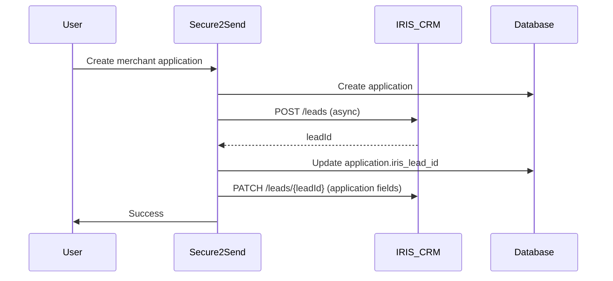
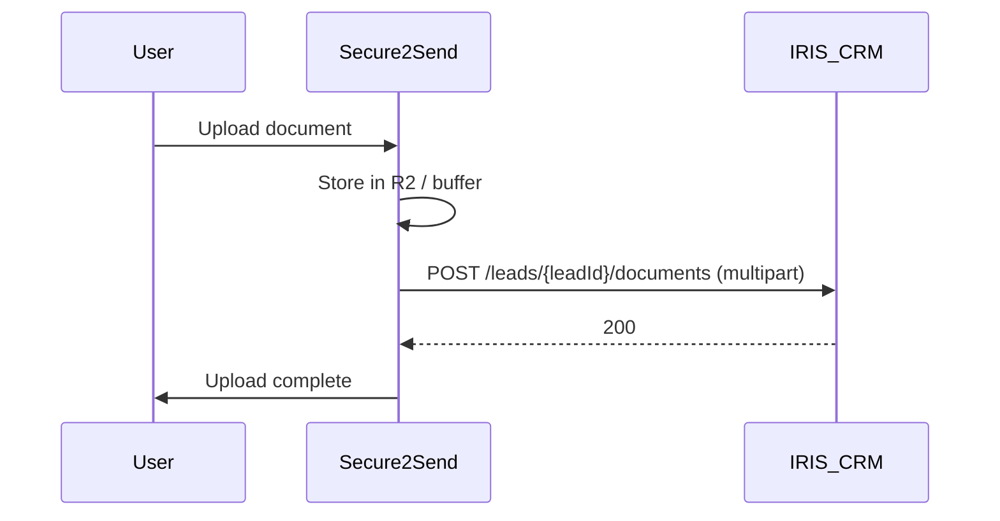

# IRIS CRM Integration Documentation

## Overview

This integration automatically syncs Secure2Send Enterprise client data with IRIS CRM, a specialized CRM for the payments industry. All sync is done **directly via the IRIS CRM API** (no Zapier in the path). The integration consists of:

1. **Lead Creation**: When new clients register or create a merchant application, leads are created in IRIS CRM.
2. **Document Sync**: When clients upload documents, they are uploaded directly to IRIS CRM via `POST /leads/{leadId}/documents`.
3. **Merchant Application Sync**: The entire merchant application is written to the correct IRIS lead fields via `PATCH /leads/{leadId}` (field ID mapping in `updateLeadWithMerchantApplication`).

## Features

### Automatic Lead Creation
- Creates IRIS CRM leads for new merchant applications (and backfills when missing).
- Maps client data: firstName, lastName, email, companyName.
- Stores IRIS lead ID on the merchant application for future reference.
- Asynchronous processing - doesn't block the user.

### Document Synchronization (Direct API)
- Uploads documents directly to IRIS CRM using `IrisCrmService.uploadDocumentToIris`.
- Accepts either a file URL (e.g. R2 signed URL) or a buffer; sends file as binary body with query params `tab`, `label`, `filename` to `POST /leads/{leadId}/documents`.
- Links documents to the correct IRIS lead.
- Asynchronous processing - doesn't block uploads.

### Merchant Application to IRIS Fields (Direct API)
- The full merchant application is mapped to IRIS lead custom fields via `updateLeadWithMerchantApplication`.
- Uses IRIS field IDs for DBA, corporate, banking, owner, financial representative, beneficial owners, authorized contacts, etc.
- Pipeline stage is updated on application lifecycle (draft, submitted, approved, rejected) via `updateLeadStatus`.

### Error Handling
- Graceful error handling - IRIS CRM failures don't break normal workflow.
- Comprehensive logging for troubleshooting.
- Continues with Secure2Send operations even if IRIS integration fails.

## Setup Instructions

### 1. Environment Configuration

Add these variables to your `.env` file:

```bash
# IRIS CRM Integration (required for lead, document, and application sync)
IRIS_CRM_API_KEY=your-iris-crm-api-key
IRIS_CRM_SUBDOMAIN=your-company-subdomain
```

**Important**: The `IRIS_CRM_SUBDOMAIN` should be your company's subdomain in IRIS CRM. For example, if your IRIS CRM URL is `https://iris.corduro.com/`, use `corduro`; if `https://secure2send.iriscrm.com/`, use `secure2send`.

**Document upload (tab/label IDs):** The IRIS API requires **integer** Tab Id and Label Id as query parameters ([API doc](https://www.iriscrm.com/api/#/paths/~1leads~1{leadId}~1documents/post)). Defaults are `1` and `2`. If upload returns "The selected label is invalid" or "The selected tab is invalid", set the correct IDs from your IRIS instance (admin document settings or API):

```bash
IRIS_DOCUMENT_TAB_ID=1
IRIS_DOCUMENT_LABEL_ID=2
```

### 2. Database

Merchant applications and clients store `iris_lead_id` where applicable. No Zapier webhook URLs are needed for IRIS document or application sync.

## API Integration Details

### Lead Creation Flow



### Document Sync Flow



### Application Update Flow

On create, update, or status change of a merchant application:

- Lead is created in IRIS if missing.
- Pipeline stage is updated via `PATCH /leads/{leadId}` (status/group).
- Full application data is sent to IRIS lead fields via `updateLeadWithMerchantApplication` (same PATCH, `fields` array with IRIS field IDs).

## Code Structure

### Core Files

1. **`server/services/irisCrmService.ts`** - Main integration service:
   - `createLead(user)` - create lead in IRIS
   - `updateLeadStatus(leadId, stage)` - move lead in pipeline
   - `uploadDocumentToIris(leadId, document, { fileUrl?, fileBuffer? })` - upload document to IRIS (direct API)
   - `updateLeadWithMerchantApplication(leadId, application)` - map entire application to IRIS lead fields
   - `uploadDocument(leadId, pdfBuffer, filename)` - used for filled PDF on approval
2. **`server/routes.ts`** - Document upload and merchant application create/update/status endpoints call the above.
3. **`shared/schema.ts`** - `irisLeadId` on merchant_applications (and clients where used).
4. **`server/env.ts`** - `IRIS_CRM_API_KEY`, `IRIS_CRM_SUBDOMAIN`.

### Key Service Methods

```typescript
// Create lead in IRIS CRM
IrisCrmService.createLead(user: User): Promise<string | null>

// Upload document directly to IRIS (no Zapier)
IrisCrmService.uploadDocumentToIris(
  leadId: string,
  document: Document,
  options: { fileUrl?: string; fileBuffer?: Buffer }
): Promise<void>

// Send entire merchant application to IRIS lead fields
IrisCrmService.updateLeadWithMerchantApplication(leadId: string, application: any): Promise<void>

// Update lead pipeline stage
IrisCrmService.updateLeadStatus(leadId: string, stage: PipelineStage): Promise<void>
```

## Monitoring & Troubleshooting

### Logs to Watch

```bash
# Lead creation
✅ IRIS CRM lead created successfully: <leadId>

# Document upload
✅ Document uploaded to IRIS CRM successfully: <filename>

# Lead fields update
✅ IRIS CRM lead updated successfully with merchant application data

# Warnings
⚠️ No IRIS lead ID found for merchant application, skipping document sync
⚠️ IRIS CRM API key or subdomain not configured
```

### Common Issues

1. **Missing API Key or Subdomain**: Ensure `IRIS_CRM_API_KEY` and `IRIS_CRM_SUBDOMAIN` are set.
2. **Network / API errors**: Check IRIS CRM API status and connectivity.
3. **Missing Lead ID**: Lead is created when the merchant application is created; backfill runs when syncing if lead was missing.

### Manual Fixes

If a merchant application is missing an IRIS lead ID, the next sync (e.g. document upload or application update) will attempt to create a lead and attach it. You can also verify in the database:

```sql
SELECT id, iris_lead_id, legal_business_name FROM merchant_applications WHERE iris_lead_id IS NULL;
```

## Security Considerations

- IRIS CRM API key is stored in environment variables (never in code).
- All API calls are made server-side over HTTPS.
- Sensitive PII is sent to IRIS for legitimate business processing; see security note in `irisCrmService.ts`.
- Graceful degradation if IRIS CRM is unavailable.

## Testing the integration

A script runs the main IRIS flows (create lead, update with application data, upload document, update status) so you can verify credentials and behavior without using the full app.

**Prerequisites:** `.env` with `IRIS_CRM_API_KEY`, `IRIS_CRM_SUBDOMAIN`, and the rest of the app env (e.g. `DATABASE_URL`, `SESSION_SECRET`), since the script uses the server env and `IrisCrmService`.

```bash
# Verify API connection only (no lead created)
npm run test:iris:connection

# Run full integration test (creates a test lead, updates fields, uploads a file, updates status)
npm run test:iris
```

Optional flags:

- `--connection-only` – Only check env and that the IRIS API accepts the key (no lead created).
- `--skip-document` – Skip the document upload step.
- `--skip-application` – Skip the merchant application field update step.

After a full run, the script prints the new lead ID; you can open that lead in IRIS CRM and confirm the application fields, Documents tab, and pipeline stage.

## Support

- [IRIS CRM API Documentation](https://www.iriscrm.com/api/)
- Contact IRIS CRM support for API keys and field ID questions.
