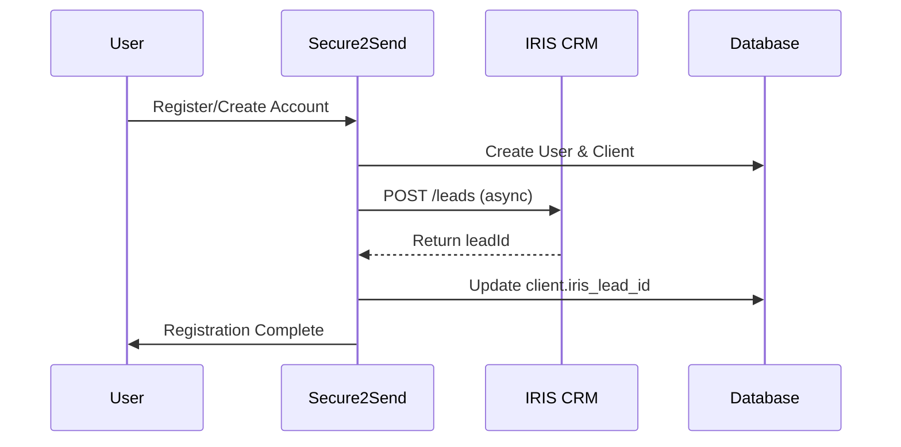
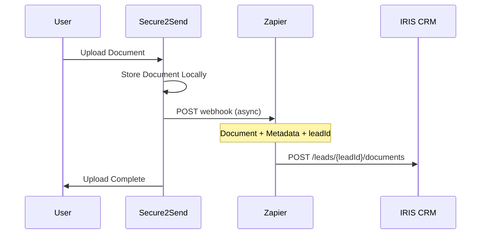

# IRIS CRM Integration Documentation

## Overview

This integration automatically syncs Secure2Send Enterprise client data with IRIS CRM, a specialized CRM for the payments industry. The integration consists of two main components:

1. **Lead Creation**: When new clients register, leads are automatically created in IRIS CRM
2. **Document Sync**: When clients upload documents, they are synced to IRIS CRM via Zapier webhook

## Features

### ✅ Automatic Lead Creation
- Creates IRIS CRM leads for new client registrations (both self-registration and admin-created)
- Maps client data: firstName, lastName, email, companyName
- Stores IRIS lead ID in Secure2Send database for future reference
- Asynchronous processing - doesn't block user registration

### ✅ Document Synchronization
- Syncs uploaded documents to IRIS CRM via Zapier webhook
- Includes document metadata and base64-encoded file content
- Links documents to the correct IRIS lead
- Asynchronous processing - doesn't block document uploads

### ✅ Error Handling
- Graceful error handling - IRIS CRM failures don't break normal workflow
- Comprehensive logging for troubleshooting
- Continues with Secure2Send operations even if IRIS integration fails

## Setup Instructions

### 1. Environment Configuration

Add these variables to your `.env` file:

```bash
# IRIS CRM Integration
IRIS_CRM_API_KEY=your-iris-crm-api-key
IRIS_CRM_SUBDOMAIN=your-company-subdomain
```

**Important**: The `IRIS_CRM_SUBDOMAIN` should be your company's subdomain in IRIS CRM. For example, if your IRIS CRM URL is `https://secure2send.iriscrm.com/`, then your subdomain is `secure2send`.

### 2. Database Migration

Run the database migration to add the IRIS lead ID field:

```bash
npm run db:push
```

Or manually run the SQL migration:

```sql
-- Migration: Add IRIS CRM integration support
ALTER TABLE clients ADD COLUMN iris_lead_id VARCHAR;
CREATE INDEX IF NOT EXISTS idx_clients_iris_lead_id ON clients(iris_lead_id);
COMMENT ON COLUMN clients.iris_lead_id IS 'IRIS CRM lead ID for integration tracking';
```

### 3. Zapier Webhook Setup

The document sync uses this Zapier webhook:
```
https://hooks.zapier.com/hooks/catch/15790762/umqr4bb/
```

Configure your Zapier automation to:
1. Receive the webhook payload
2. Extract document data and lead ID
3. Upload to IRIS CRM using their documents API

## API Integration Details

### Lead Creation Flow



### Document Sync Flow



## Code Structure

### Core Files Added/Modified

1. **`server/services/irisCrmService.ts`** - Main integration service
2. **`shared/schema.ts`** - Added `irisLeadId` field to clients table
3. **`server/storage.ts`** - Added method to update lead ID
4. **`server/auth.ts`** - Integrated lead creation in registration
5. **`server/routes.ts`** - Integrated lead creation and document sync
6. **`server/env.ts`** - Added IRIS CRM environment variables
7. **`migrations/003_add_iris_integration.sql`** - Database migration

### Key Service Methods

```typescript
// Create lead in IRIS CRM
IrisCrmService.createLead(user: User): Promise<string | null>

// Sync document via Zapier webhook
IrisCrmService.syncDocumentToIris(
  user: User, 
  document: Document, 
  leadId: string,
  filePath: string
): Promise<void>

// Update lead information (for future use)
IrisCrmService.updateLead(leadId: string, updateData: Partial<IrisLead>): Promise<void>
```

## Zapier Webhook Payload

The webhook sends this JSON structure:

```json
{
  "leadId": "iris-lead-uuid",
  "document": {
    "filename": "generated-filename.pdf",
    "originalName": "user-uploaded-name.pdf",
    "documentType": "CANNABIS_LICENSE",
    "fileSize": 1234567,
    "mimeType": "application/pdf",
    "fileContent": "base64-encoded-file-content"
  },
  "client": {
    "firstName": "John",
    "lastName": "Doe",
    "email": "john@example.com",
    "companyName": "Example Cannabis Co."
  }
}
```

## Monitoring & Troubleshooting

### Logs to Watch

```bash
# Successful lead creation
✅ IRIS CRM lead created successfully: lead-uuid-123

# Successful document sync
✅ Document synced to IRIS CRM successfully: {...}

# Error logs
❌ Failed to create IRIS CRM lead: [error details]
❌ Failed to sync document to IRIS CRM: [error details]

# Warning when no lead ID exists
⚠️ No IRIS lead ID found for client, skipping document sync
```

### Common Issues

1. **Missing API Key**: Check `IRIS_CRM_API_KEY` environment variable
2. **Network Issues**: IRIS CRM API connectivity problems
3. **Missing Lead ID**: Client created before integration was enabled
4. **Zapier Webhook Failures**: Check Zapier automation logs

### Manual Fixes

If a client is missing an IRIS lead ID, you can manually create one:

```sql
-- Find clients without IRIS lead IDs
SELECT c.id, u.email, u.company_name 
FROM clients c 
JOIN users u ON c.user_id = u.id 
WHERE c.iris_lead_id IS NULL;

-- Update with IRIS lead ID (after manual creation in IRIS CRM)
UPDATE clients SET iris_lead_id = 'your-iris-lead-id' WHERE id = 'client-uuid';
```

## Testing

### Test Lead Creation

1. Register a new client account
2. Check logs for IRIS CRM integration messages
3. Verify lead appears in IRIS CRM
4. Check database for `iris_lead_id` in clients table

### Test Document Sync

1. Upload a document as a client (with existing lead ID)
2. Check logs for Zapier webhook call
3. Verify document appears in IRIS CRM under correct lead
4. Check Zapier automation logs

## Future Enhancements

- [ ] Bulk sync existing clients to IRIS CRM
- [ ] Two-way sync (IRIS CRM updates back to Secure2Send)
- [ ] Enhanced error recovery and retry logic
- [ ] Real-time status updates from IRIS CRM
- [ ] Support for additional IRIS CRM fields
- [ ] Direct API integration option (bypass Zapier)

## Security Considerations

- IRIS CRM API key is stored securely in environment variables
- Document content is base64 encoded for webhook transmission
- All API calls are made server-side (no client exposure)
- Comprehensive audit logging for compliance
- Graceful degradation if IRIS CRM is unavailable

## Support

For IRIS CRM API documentation and support:
- [IRIS CRM API Documentation](https://www.iriscrm.com/api/)
- Contact IRIS CRM support for API key issues
- Check Zapier automation logs for webhook issues
